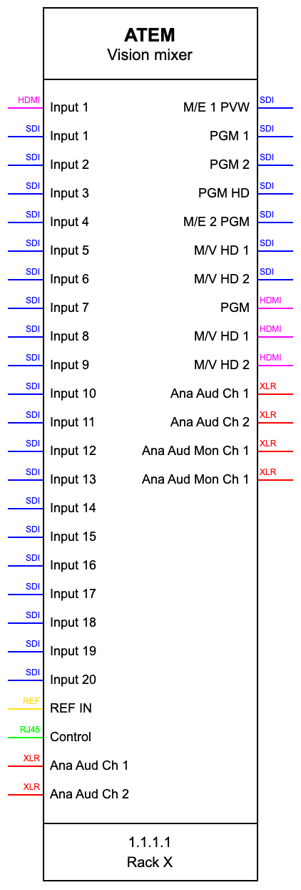

Generates draw.io shapes that look like this:

Run `node drawio.js`, pick the device you want, insert a 'Shape' in draw.io, paste the clipboard into the box and resize the shape to the dimensions shown in the console
